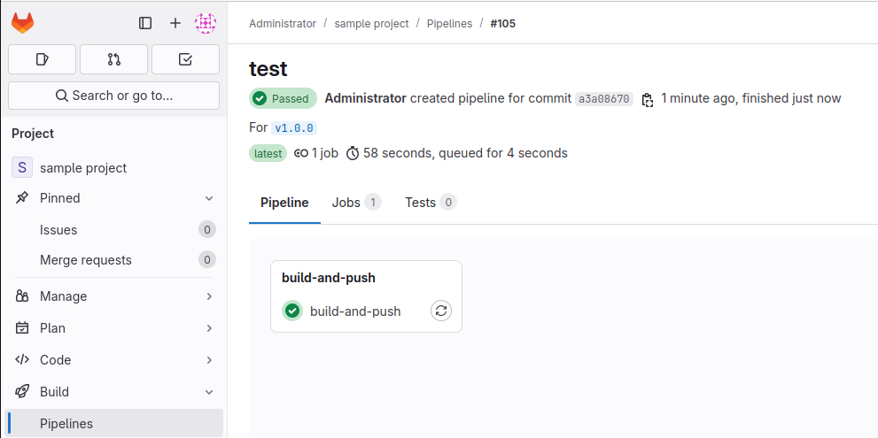
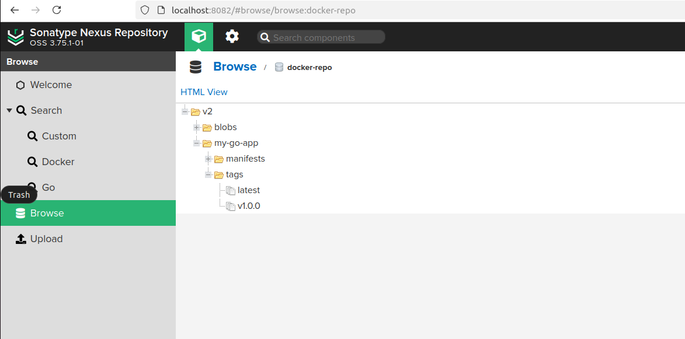
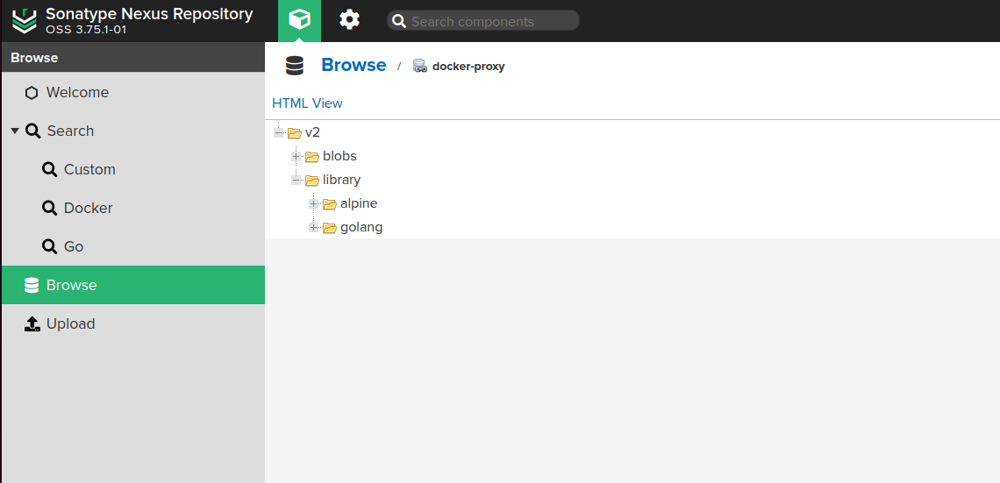
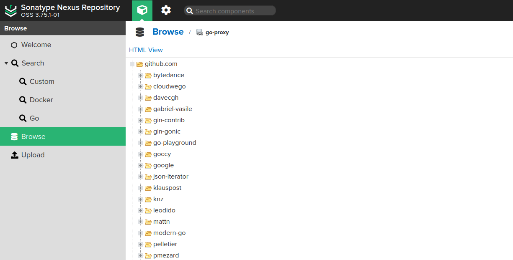

# Autonomous Build System

## Description
This repository contains docker compose config to deploy gitlab, gitlab-runner and nexus services.
The ``sample/.gitlab-ci.yml`` file contains pipeline config to build and save docker images in nexus
docker hosted repository on new tag push. Pipeline and Dockerfile are configured to use docker and
go proxy repositories for caching project dependencies.

## Features
- **Docker image caching**: docker images are cached in docker-proxy repository.
- **Go packages caching**: go packages are cached in go-proxy repository.
- **Autonomous builds**: proxy repositories' caching allow offline builds, or when requested resource origin is no longer accessible.

## Example
#### When new tag is pushed, pipeline is triggered:


#### Built images are saved in docker hosted repo:


#### Required images are cached in docker proxy repo:


#### Required packages are cached in go proxy repo:


## Getting started

### Run the system
 - ``docker compose up -d``
 - Obtain nexus password, created in nexus container
 - Change the gitlab root user password 

### Register gitlab runner
 - ``docker exec -it gitlab-runner gitlab-runner register``
 - Paste token obtained in gitlab Admin area -> runners

#### Add runner to custom network (abs_abs in this case): <br>
   inside gitlab-runner <br> 
``/etc/gitlab-runner/config.toml``:
```toml
[runners.docker]
    ...
    network_mode = "abs_abs"
    ...
```

### Create sample project
 - Add new project to gitlab
 - Add Dockerfile
 - Add CI\CD pipeline

### Configure nexus repositories
 - Add docker hosted repository to store built images.
 - Add docker proxy repository to cache images from docker hub.
 - Add go proxy repository to cache go dependencies from different sources.
            
